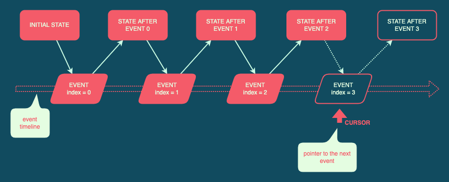

Sequent
===
A library for interactive discrete-event simulation.

[](https://crates.io/crates/sequent)
[](https://docs.rs/sequent)
[](https://github.com/kindredgroup/sequent/actions/workflows/master.yml)
[](https://codecov.io/gh/kindredgroup/sequent)

# Simulation Concepts
## What's a DES?
A [Discrete-Event Simulation (DES)](https://en.wikipedia.org/wiki/Discrete-event_simulation) models a system as a sequence of events, wherein each event transitions the system from one state to the next. This contrasts with _continuous simulation_ in which the system state is "smoothly" varied over time using a set of differential equations.

A DES works well for simulating systems where events that have a material bearing on the underlying state occur (relatively) infrequently. This apparent sparsity lets us model the system with a [Finite-State Machine (FSM)](https://en.wikipedia.org/wiki/Finite-state_machine).

## Initial state and the event timeline
Every DES can be represented as a combination of some _initial state_ and a sequential _event timeline_. Some systems only model the future (i.e., pending) events, typically using a queue. Sequent treats the timeline as a concatenation of past and future events, using a floating _cursor_ to demarcate between the two sequences. The Sequent DES is _interactive_; i.e., not only can it execute events autonomously, but it also lets the user step in and alter the course of the simulation. Since the user can come up with an alternate timeline, Sequent retains all events so that they can be saved to disk and replayed later (if the user chooses to). It also means that Sequent has no timeline bootstrapping requirement (unlike non-interactive simulations, which require at least one initial event) — you can initialise it with an empty timeline and add new events from a [REPL](https://en.wikipedia.org/wiki/Read%E2%80%93eval%E2%80%93print_loop)-style (read-eval-print loop) interface.

A DES works by evaluating events in _chronological sequence_; an event transitions the system from its current (pre-event) state to the next (post-event) state. An example might be adding an element to a set: in some existing state, the set lacks an element. After the execution of the (hypothetical) `add-element` event, the element will be a member of the set.

Events in the timeline are indexed, starting with index zero for the first event, one for the second, and so forth. The _cursor_ acts as a pointer to the next event queued for evaluation.



## Interactivity and timeline truncation
When combined with a UI, Sequent allows you to progressively step through the simulation, observing every intermediate state. You can "jump" to any state, which might mean either rewinding or fast-forwarding the simulation.

The real interactivity, however, comes from the ability to manually alter the timeline by injecting new events at arbitrary locations. There is one notable constraint: inserting an event into the middle of the timeline requires truncating all events following the point of insertion.

We've all seen Hollywood films where a character travels back in time and ends up inadvertently altering the (then-)future, returning to a very different present. Remember the famous quote — _"it could cause a chain reaction that would unravel the very fabric of the space-time continuum"_ — by Dr Emmet Brown? As it turns out, the "Doc" was right.

Consider a scenario involving financial portfolio optimisation. At some time _T_<sub>_M_</sub>, funds were injected manually into the holding. At a later time _T_<sub>_N_</sub>, the simulation rebalanced the portfolio, exchanging funds for equities, and the simulation state was updated accordingly. Suppose we rewind the simulation to _T_<sub>_M_</sub> and inject a smaller amount instead. Upon returning to _T_<sub>_N_</sub>, we will observe an inconsistent state — excess equity that appears to have materialised from thin air. To avoid such anomalies, the DES requires us to forfeit all future events when inserting a new event at any point in the timeline.

# Getting started
## Add dependency
```sh
cargo add sequent
```

## An example
See [`examples/snail.rs`](sequent/examples/snail.rs) for a simple discrete-event simulation of a highly determined snail climbing a wall. 